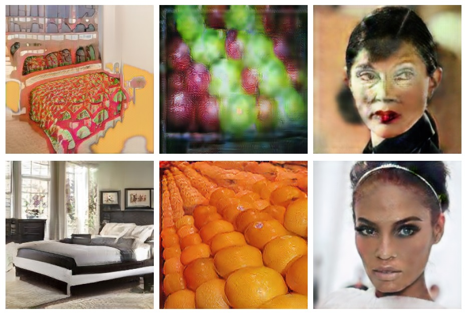

In the last few years, generative adversarial networks (GAN) have shown tremendous potential for a number of applications 
in computer vision and related fields. With the current pace of progress, it is a sure bet they will soon be able to generate 
high-quality images and videos, virtually indistinguishable from real ones. 
Unfortunately, realistic GAN-generated images pose serious threats to security, to begin with a possible flood of fake multimedia, 
and multimedia forensic countermeasures are in urgent need. 
In this work, we show that each GAN leaves its specific fingerprint in the images it generates, 
just like real-world cameras mark acquired images with traces of their photo-response non-uniformity pattern. 
Source identification experiments with several popular GANs show such fingerprints to represent a precious asset for forensic analyses.

For better reproducibility and comparison, we release the dataset used in the paper, containing the images generated the considered GAN architectures: Cycle-GAN [1], ProGAN [2], StarGAN [3], glow [4].

[1] J. Y. Zhu, T. Park, P. Isola, and A. A. Efros. Unpaired imageto-image translation using cycle-consistent adversarial networks. In IEEE International Conference on Computer Vision, 2017

[2] T. Karras, T. Aila, S. Laine, and J. Lehtinen. Progressive Growing of GANs for Improved Quality, Stability, and Variation. In International Conference on Learning Representations, 2018

[3] Y. Choi, M. Choi, M. Kim, J.-W. Ha, S. Kim, and J. Choo. StarGAN: Unified Generative Adversarial Networks for Multi-Domain Image-to-Image Translation. In IEEE Conference on Computer Vision and Pattern Recognition, 2018

[4] D. P. Kingma, P. DhariwalGlow. Generative Flow with Invertible 1x1 Convolutions. arXiv.1807.03039, 2018


### News

*   2018-12-31: Paper available on Arxiv.
*   2019-02-26: Paper accepted at the 2nd FakeMultiMedia Workshop 2019 IEEE Conference on Multimedia Information Processing and Retrieval (MIPR)


### Bibtex

```js
@inproceedings{Marra2019_DoGANs, 
author={F. Marra and D. Gragnaniello and L. Verdoliva and G. Poggi}, 
booktitle={2018 IEEE Conference on Multimedia Information Processing and Retrieval (MIPR)}, 
title={Do GANs leave artificial fingerprints?}, 
year={2019},
month={March},
DOI={10.1109/MIPR.2019.00103}
} 
```
